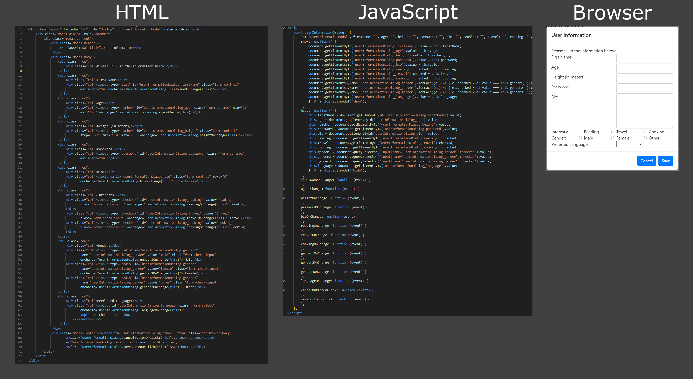

# DGen Bootstrap Dialog Generator
## From Oddbeaker LLC

Converts a simple "DGen" markup to a Bootstrap modal dialog and a javascript object that can hide, display, populate and fetch all form field data. Here is an example of DGen that contains all form field types:

    <{User Information}>
    <{Please fill in the information below:}>
    <{First Name:}{[T:firstName,50]}>
    <{Age:}{[N:age,18,100]}>
    <{Height (in meters):}{[F:height,1.0,2.5]}>
    <{Password:}{[P:password,50]}>
    <{Bio:}{[A:bio,5]}>
    <{Interests:}
    {[X:reading] Reading}
    {[X:travel] Travel}
    {[X:cooking] Cooking}>
    <{Gender:}
    {[R:gender1,gender,male] Male}
    {[R:gender2,gender,female] Female}
    {[R:gender3,gender,other] Other}>
    <{Preferred Language:}
    {[D:language]}>
    <{[B:cancelButton,Cancel][B:saveButton,Save]}>

The above DGen notation will produce this:

## Instructions

1. Type your DGen directly into your HTML file, at the point where you want the code generated. 
2. Select the block of DGen text.
3. Press Alt-Shift-D and POOF! Instant modal dialog with all the code to handle it.
4. Style your generated HTML as needed.
5. Fill in your change and click handlers as needed.

That's it!

## DGen notation reference

- Rows are marked with "<" and ">".
- Columns are marked with "{" and "}".
- Form fields are marked with "[" and "]".
- Any text within a column is copied as it appears.
- The first row of the dialog must have a single column with title that will be used to calculate the dialog and object names. For example:

    <{User Information}>

- The last row of the dialog will become the footer. It must have a single column containing buttons such as the Save and Cancel buttons. For example:

    <{[B:cancelButton,Cancel][B:saveButton,Save]}>

## DGen field reference
- **[A:id,rows]** - Textarea with "rows" rows, whose ID is "id"
- **[B:id,label]** - Button with ID and label.
- **[D:id]** - Dropdown list whose ID is "id"
- **[F:id,min,max]** - Number field with ID and min, max values.
- **[N:id,min,max]** - Integer field with ID and min, max values.
- **[P:id,length]** - Password field with ID and maxlength.
- **[R:id,group,value]** - Radio button with ID, group, value.
- **[T:id,length]** - Text field whose ID is "id" and maxlength is "length".
- **[X:id]** - Checkbox with ID 

## Requirements

If you have any requirements or dependencies, add a section describing those and how to install and configure them.

## Extension Settings

Include if your extension adds any VS Code settings through the `contributes.configuration` extension point.

For example:

This extension contributes the following settings:

* `myExtension.enable`: Enable/disable this extension.
* `myExtension.thing`: Set to `blah` to do something.

## Known Issues

Calling out known issues can help limit users opening duplicate issues against your extension.

## Release Notes

Users appreciate release notes as you update your extension.

### 1.0.0

Initial release of ...

### 1.0.1

Fixed issue #.

### 1.1.0

Added features X, Y, and Z.

---

## Working with Markdown

You can author your README using Visual Studio Code.  Here are some useful editor keyboard shortcuts:

* Split the editor (`Cmd+\` on macOS or `Ctrl+\` on Windows and Linux)
* Toggle preview (`Shift+Cmd+V` on macOS or `Shift+Ctrl+V` on Windows and Linux)
* Press `Ctrl+Space` (Windows, Linux, macOS) to see a list of Markdown snippets

## For more information

* [Visual Studio Code's Markdown Support](http://code.visualstudio.com/docs/languages/markdown)
* [Markdown Syntax Reference](https://help.github.com/articles/markdown-basics/)

**Enjoy!**
